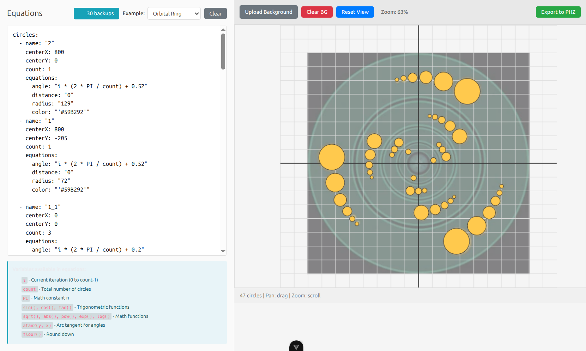
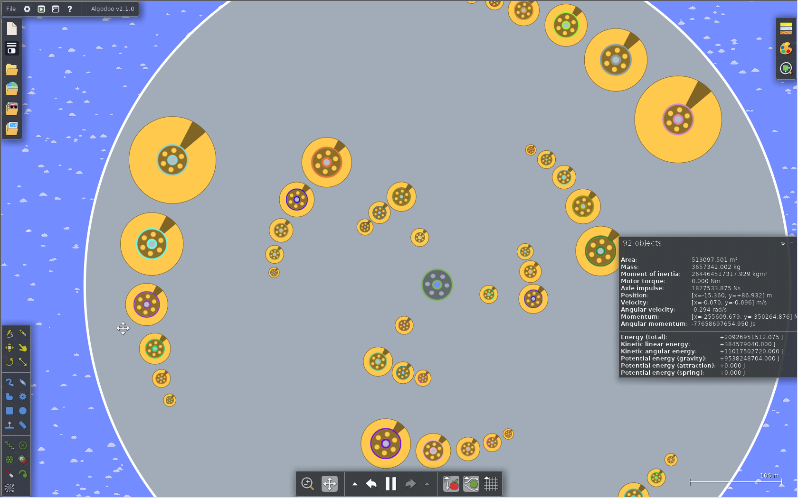

# Algodoo Generator

A modern web-based prototype for generating and analyzing circular objects in [Algodoo](https://www.algodoo.com/), a 2D physics simulator. This tool allows you to create complex patterns of circles using mathematical equations and export them as Algodoo scenes.

## What is Algodoo?

Algodoo is a 2D physics simulator. Algodoo generation tool lets you generate complex patterns of circles using mathematical equations and export them to Algodoo for simulation and analysis.

## Features

- **Math Equation Editor** - Define circles using mathematical equations (supports examples: Orbital Ring, Spiral, Grid Pattern, Wave Pattern, Fibonacci Spiral)
- **Background Upload** - Upload custom backgrounds for your scenes
- **Backup System** - Automatic backup history to never lose your work
- **Circle Position Control** - Precisely control circle positions, sizes, and properties
- **Algodoo Export** - Export your scenes as `.phn` files compatible with Algodoo
- **State Management** - Pinia store for persistent storage of your equations, backups, and settings
- **Live Preview** - See your circles rendered in real-time as you edit equations

## Use Cases

- **Circular Objects Analysis** - Study the behavior and interactions of patterns of circular objects
- **Crop Circles Analysis** - Generate geometric patterns for analysis and simulation
- **Physics Pattern Visualization** - Create and simulate complex mathematical patterns in a physics environment
- **Educational Demonstrations** - Teach physics and mathematics through interactive simulations
- **Algorithmic Art** - Generate beautiful procedural patterns for artistic purposes

## Screenshots

### Editor Interface


### Algodoo Result



## How It Works

1. **Enter Equations**: Write mathematical equations to define circle positions and properties
2. **Live Preview**: See your circles rendered in the editor
3. **Backup & History**: Your work is automatically backed up
4. **Export**: Generate a `.phz` file that can be imported directly into Algodoo
5. **Simulate**: Open the exported file in Algodoo and run physics simulations


## Installation & Setup

### Prerequisites
- Node.js (v16 or higher)
- npm or yarn

### Steps

1. **Clone the repository**
   ```sh
   git clone <repository-url>
   cd algodoo_generator
   ```

2. **Install dependencies**
   ```sh
   npm install
   ```

3. **Start development server**
   ```sh
   npm run dev
   ```
   The app will be available at `http://localhost:5173` (or the next available port)


##  Development

### Tech Stack
- **Framework**: Vue 3 with TypeScript
- **Build Tool**: Vite
- **State Management**: Pinia
- **Styling**: Bulma CSS + Tailwind CSS
- **Math**: Math.js for equation parsing
- **Archive**: JSZip for Algodoo file export


### Project Structure

```
src/
├── components/       # Vue components (Editor, BackupHistory, CirclePreview, etc.)
├── stores/          # Pinia stores (equation, backup, notification)
├── services/        # Business logic (phzExporter for Algodoo export)
├── composables/     # Vue composition utilities (useEquationParser)
├── views/           # Page views
├── router/          # Vue Router configuration
└── assets/          # CSS and static files
```

## Credits

 - **Umberto Baudo** - inspiration
 - **Algoryx Simulation AB** - for creating an Algodoo platform

## Keywords

physics, simulation, circular objects, math visualization, algorithmic art, crop circles, algodoo.

##  License

See the [LICENSE](LICENSE) file for details.

##  Contributing

Contributions are welcome! Feel free to submit issues and pull requests.
